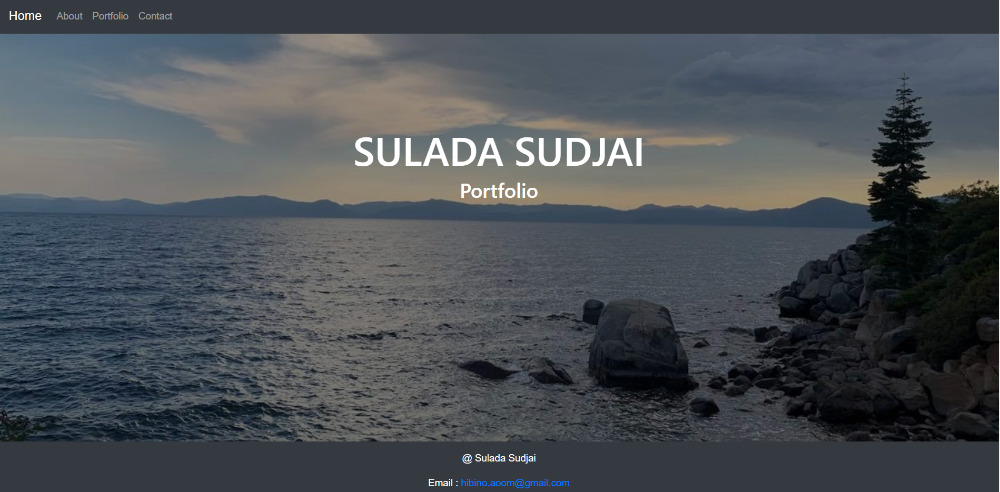
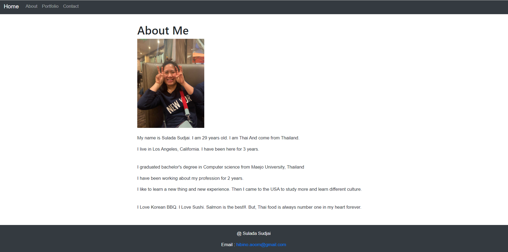
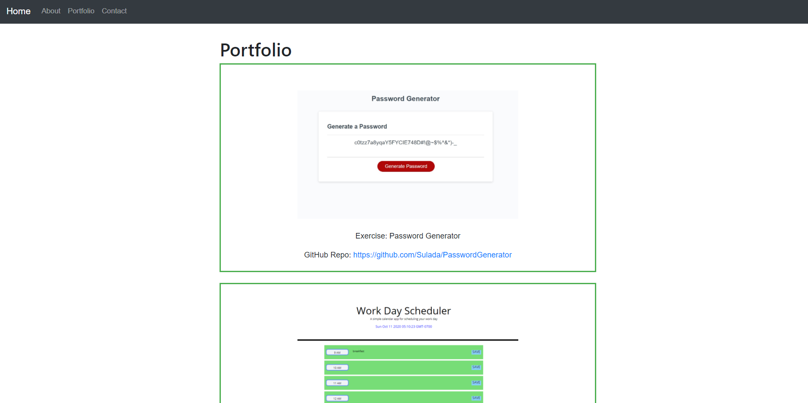
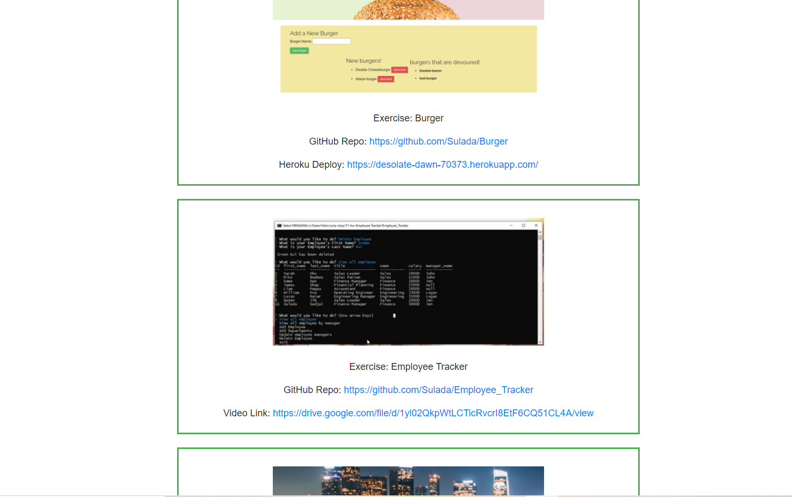
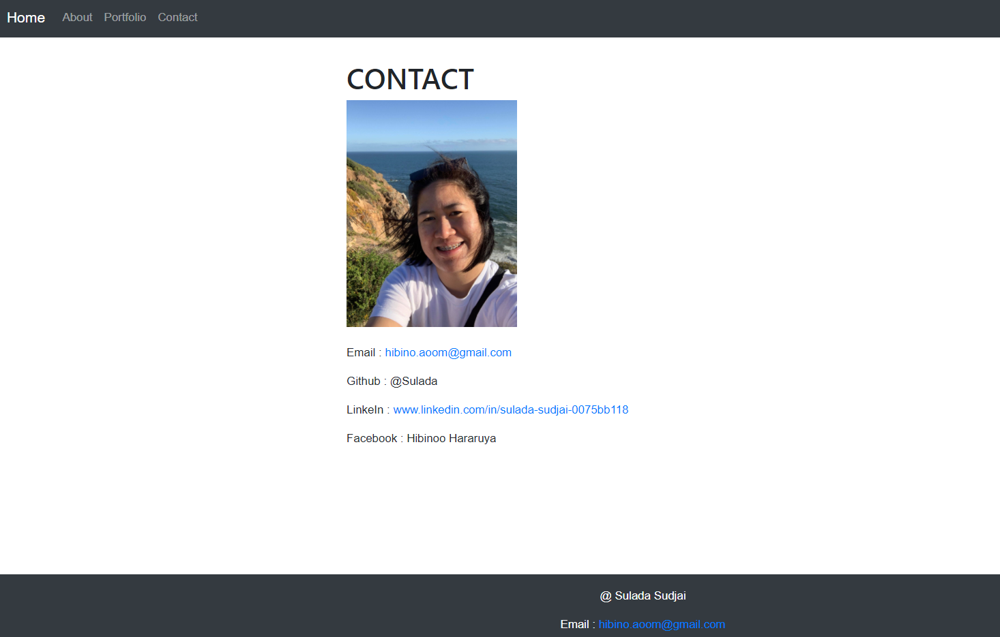

# React Portfolio

Updating portfolio and other materials to build toward being employer competitive. Creating a portfolio using React.

## Requirements

* Updated portfolio featuring 6 total projects

* Use React

* A `Header` component that appears on multiple pages

* A single `Project` component that will be used multiple times on a single page 

* Navigation with React Router, dynamic rendering, or another third part router

* A `Footer` component that appears on multiple pages

* Update GitHub profile with pinned repositories featuring those same projects

* Deploy this site to GitHub Pages

## Home Page : 

## About Me :

## Portfolio :

## Contact :

